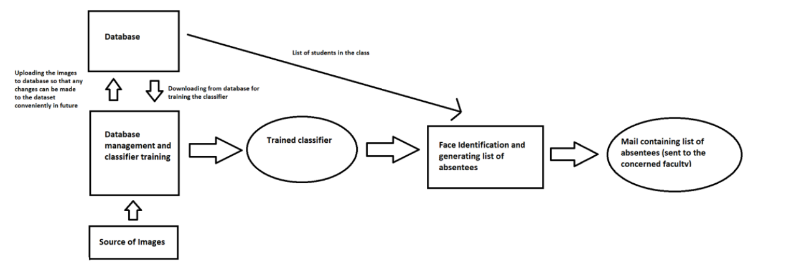

# Face recognition based classroom attendance system

A Desktop application for generating a list of absentees and mailing it to the concerned faculty from a live photo of the classroom

Implemented in Python, uses face_recognition for generating face encodings (Deep Learning) and linear classifier, svm from sklearn (Machine learning) for identifying faces 

MongoDB was used as database backend and GUI for the application was developed with TKinter 

System architecture:

